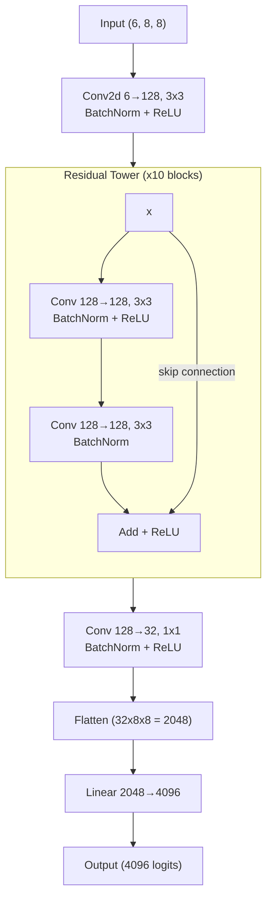

# neural-chess

A chess engine powered by a residual convolutional neural network, trained on 23 million board+move pairs extracted from over 800,000 historical games.

## How It Works

Given a board position, it outputs a probability distribution over all possible moves. It picks the move it considers most likely to be what a winning human player would choose.

### Input: Board Representation

The board is encoded as 6 planes of 8x8, one per piece type. Each square contains `+1` (white piece), `-1` (black piece), or `0` (empty):

```
Plane 0: Pawns              Plane 1: Rooks
   a  b  c  d  e  f  g  h     a  b  c  d  e  f  g  h
8  .  .  .  .  .  .  .  .  8 -1  .  .  .  .  .  . -1
7 -1 -1 -1 -1 -1 -1 -1 -1  7  .  .  .  .  .  .  .  .
6  .  .  .  .  .  .  .  .  6  .  .  .  .  .  .  .  .
5  .  .  .  .  .  .  .  .  5  .  .  .  .  .  .  .  .
4  .  .  .  .  .  .  .  .  4  .  .  .  .  .  .  .  .
3  .  .  .  .  .  .  .  .  3  .  .  .  .  .  .  .  .
2 +1 +1 +1 +1 +1 +1 +1 +1  2  .  .  .  .  .  .  .  .
1  .  .  .  .  .  .  .  .  1 +1  .  .  .  .  .  . +1

Plane 2: Knights            Plane 3: Bishops
   a  b  c  d  e  f  g  h     a  b  c  d  e  f  g  h
8  . -1  .  .  .  . -1  .  8  .  . -1  .  . -1  .  .
7  .  .  .  .  .  .  .  .  7  .  .  .  .  .  .  .  .
6  .  .  .  .  .  .  .  .  6  .  .  .  .  .  .  .  .
5  .  .  .  .  .  .  .  .  5  .  .  .  .  .  .  .  .
4  .  .  .  .  .  .  .  .  4  .  .  .  .  .  .  .  .
3  .  .  .  .  .  .  .  .  3  .  .  .  .  .  .  .  .
2  .  .  .  .  .  .  .  .  2  .  .  .  .  .  .  .  .
1  . +1  .  .  .  . +1  .  1  .  . +1  .  . +1  .  .

(+ Planes 4-5 for Queens and Kings follow the same pattern)
```

This gives the model a spatial view of the board — it can learn patterns like "a knight on e4 attacks these squares" through convolution, rather than memorizing every possible position.

When the model plays as black, the board is rotated 180 degrees and the piece colors are swapped, so the model always sees the position from the moving player's perspective.

### Model: Residual CNN (~11M parameters)

The architecture is inspired by [AlphaZero](https://arxiv.org/abs/1712.01815) and [Leela Chess Zero](https://lczero.org/), using a residual convolutional neural network:



**Why convolutions?** Chess is spatial — a piece's influence depends on its position relative to other pieces. Convolutional layers have a built-in understanding of locality (nearby squares matter more) and translation (the same pattern can appear anywhere on the board). A fully-connected network would have to learn all of this from scratch.

**Why residual connections?** The skip connections (adding the block's input back to its output) solve a key problem in deep networks: they allow gradients to flow directly back through many layers during training, preventing the "vanishing gradient" problem. This lets us stack 10 blocks deep (22 convolutional layers total) without the network becoming harder to train. Each block only needs to learn the *difference* from its input, rather than a complete transformation.

**Why batch normalization?** BatchNorm normalizes the values flowing through the network, which stabilizes training and allows higher learning rates. It's placed after each convolution so that every layer receives well-scaled inputs regardless of how the earlier layers are behaving.

### Output: Move Prediction

The output is 4,096 logits representing a 64x64 grid: every possible (from_square, to_square) pair. After softmax, this becomes a probability distribution over moves:

```
                       to
             a1   b1   c1  ...  h8
          ┌─────────────────────────┐
     a1   │ .00  .00  .00  ...  .00 │
     b1   │ .02  .00  .00  ...  .00 │
from c1   │ .00  .00  .07  ...  .10 │
     ..   │ ...                     │
     e2   │ .00  .00  .03  ...  .12 │  ← e2→h8 = 12%
     ..   │ ...                     │
     h8   │ .03  .00  .00  ...  .05 │
          └─────────────────────────┘
```

At inference time, the engine takes the highest-probability move and checks if it's legal. If not, it zeros out that prediction and tries the next-best move, repeating until it finds a legal one.

### Training

The model learns by supervised imitation: given 23 million positions from historical games, it tries to predict the move that the game's winner actually played. The training signal is cross-entropy loss — the model is penalized more when it assigns low probability to the correct move.

| Component | Choice | Why |
|-----------|--------|-----|
| Optimizer | AdamW | Robust default, adds proper weight decay for regularization |
| LR Schedule | Cosine annealing | High LR early for fast learning, low LR later for fine-tuning |
| Precision | FP16 mixed | 2x throughput on tensor cores with negligible accuracy loss |
| Batch size | 4,096 | Balances GPU utilization with gradient noise |
| Loss | Cross-entropy | Standard for classification over 4,096 move classes |

### Limitations

This is a pure policy network with no search. It picks a move in one shot based on pattern matching, which means:

- It cannot "think ahead" or consider consequences of a move
- It has no concept of whether a position is winning or losing
- It learns from noisy labels (game winners still make bad moves)
- It has no knowledge of castling rights or en passant availability (not encoded in the input)

Despite this, it discovers real chess concepts from the data: piece development, king safety, pawn structure, tactical patterns, and more.

## Setup

Create a virtual environment and install dependencies:

```bash
python -m venv .venv
.venv\Scripts\activate      # Windows
#source .venv/bin/activate  # Linux/macOS

pip install -r requirements.txt
```

For CUDA GPU acceleration (recommended for training), install PyTorch with CUDA support:

```bash
pip install torch --index-url https://download.pytorch.org/whl/cu124
```

You will also need [Stockfish](https://stockfishchess.org/download/) installed at `bin/stockfish` (or pass a custom path) to run engine-vs-engine tests.

## Training

Train from the existing NPZ data files in `data/`:

```bash
python train.py
```

Training runs indefinitely until you create a `.stop` file in the project root. The model is checkpointed to `model/` after every epoch.

To resume training from a checkpoint:

```python
from train import train
train(resume_pt='model/model_e0010.pt', start_epoch=11)
```

## Playing

### vs Stockfish

```bash
python play.py model_e0010 engine --games 10
```

Options:

| Flag | Default | Description |
|------|---------|-------------|
| `-n`, `--games` | 10 | Number of games to play |
| `-d`, `--depth` | 0 | Stockfish search depth |
| `-s`, `--skill` | 0 | Stockfish skill level (0-20) |
| `--color` | white | Color the model plays (`white` or `black`) |
| `--stockfish` | `bin/stockfish.exe` | Path to Stockfish executable |

Example against a stronger Stockfish:

```bash
python play.py model_e0010 engine --games 50 --depth 5 --skill 10 --color black
```

### Interactive

Play against the model in the terminal (you play white, the model plays black):

```bash
python play.py model_e0010 interactive
```

Enter moves in UCI notation (e.g. `e2e4`, `g1f3`). Type `quit` to exit.

## UCI / Arena GUI

To use with a UCI-compatible chess GUI (e.g., [Arena](http://www.playwitharena.de)):

1. Select **Engines → Manage → New**
2. Browse to your `python.exe` (inside `.venv\Scripts\`)
3. Set **Command Line Parameters** to: `<repo_root>\uci.py <path_to_model.pt>`
4. The engine supports playing as both white and black

Model files use the `.pt` extension (PyTorch state dicts).
